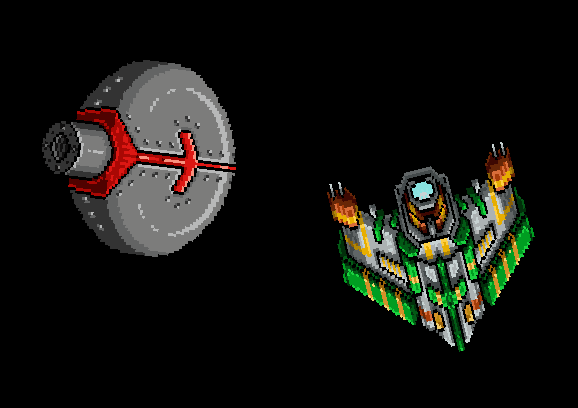

# Flutter Flame rotate example



SpriteComponent is a PositionComponent.  Every PositionComponent has
an angle that can be set.

```dart
  @override
  void update(double dt) {
    super.update(dt);
    turret.angle += turretSpeed * dt;
    turret.angle %= 2 * math.pi;

    ship.angle += shipSpeed * dt * -1;
    ship.angle %= 2 * math.pi;
  }
```